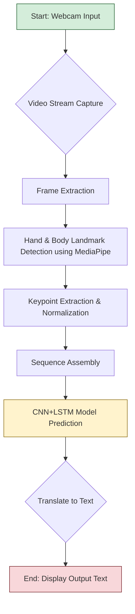
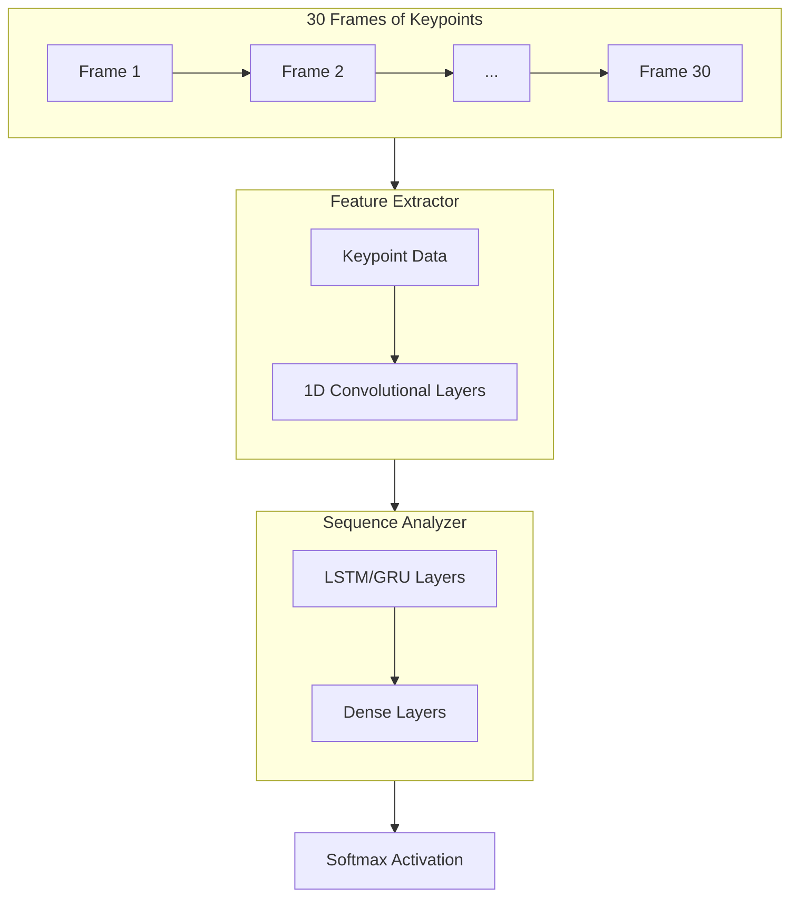
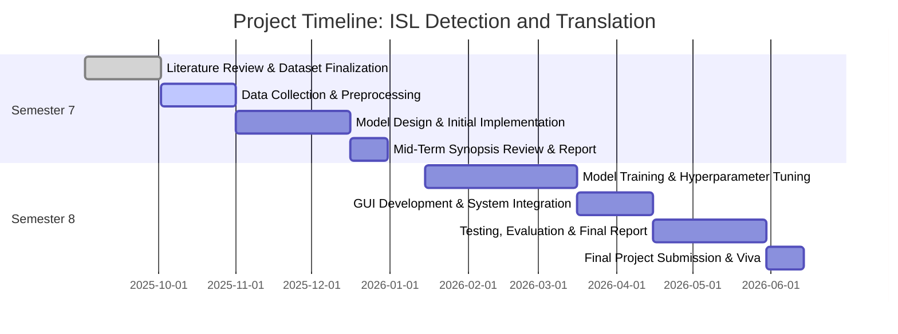

# Project Synopsis
## A Deep Learning Approach for Real-Time Indian Sign Language (ISL) Detection and Translation

**Submitted by:**  
> 1. Sabir Mallick  
> 12031522014  
> 2. Chandrajit Banerjee  
> 12031522060  
> 3. Aditi Biswas  
> 12031522049  

**Submitted to:**  
Prof. Prasenjit Maji  
Department of Computer Science and Design  
Dr. B.C. Roy Engineering College, Durgapur  

**Date:** September 1, 2025  

  
## 1. Abstract
Communication is a fundamental human right, yet a significant barrier exists for the millions of individuals in India who use Indian Sign Language (ISL) as their primary mode of communication. This project aims to bridge this communication gap by developing a real-time, fast, and accurate system for detecting and translating ISL gestures into text. The proposed solution will deliver an end-to-end system that leverages deep learning and computer vision to create an accessible tool, optimized to run efficiently on standard consumer-grade hardware.

The system will employ a hybrid deep learning architecture, combining a Convolutional Neural Network (CNN) for spatial feature extraction from video frames and a Long Short-Term Memory (LSTM) network to interpret the temporal dynamics of sign language gestures. We will utilize the MediaPipe framework for highly efficient hand and body landmark detection to ensure high-speed processing and accuracy. The model will be trained on a comprehensive dataset of ISL signs, and its output will be a real-time stream of translated text corresponding to the gestures performed by the user. The successful implementation of this project will provide a vital tool for fostering inclusivity and empowering the deaf and hard-of-hearing community in their daily interactions.

**Keywords:** Indian Sign Language (ISL), Deep Learning, Computer Vision, Real-Time Gesture Recognition, Convolutional Neural Network (CNN), Long Short-Term Memory (LSTM), MediaPipe, Human-Computer Interaction (HCI).

  
## 2. Introduction
### 2.1 Background
Indian Sign Language (ISL) is a rich and complex visual-gestural language used by an estimated over 5 million people (according to various NGO and community estimates) across India. Unlike spoken languages, ISL relies on handshapes, movements, facial expressions, and body language to convey meaning. However, a vast majority of the hearing population in India is not fluent in ISL, creating significant hurdles for the deaf community in crucial sectors like education, healthcare, public services, and employment. This "communication divide" often leads to social isolation and limited access to opportunities.

### 2.2 Problem Statement
While technological advancements have transformed communication, solutions tailored for the ISL community remain scarce and often impractical. Existing methods may require expensive, specialized hardware like sensor-equipped gloves or are limited to recognizing a small vocabulary of static signs (e.g., individual letters), failing to capture the fluid, motion-based nature of conversational sign language. Therefore, there is a pressing need for a low-cost, software-based solution that can accurately interpret a wide range of both static and dynamic ISL gestures in real-time.

### 2.3 Objectives
The primary objectives of this project are:
- To design and develop a robust system for detecting and recognizing dynamic Indian Sign Language gestures from a live video stream.
- To achieve high accuracy and low latency to ensure the translation is fast and practical for real-world conversations.
- To build the system using open-source libraries and frameworks, ensuring it can be deployed on standard computers without specialized hardware.
- To create a user-friendly interface that displays the translated text in an easily readable format.
- To evaluate the model's performance rigorously using standard machine learning metrics.

### 2.4 Scope
The initial scope of this project will be to recognize a vocabulary of 50-100 common ISL words and phrases, including both static gestures (alphabets, numbers) and dynamic gestures (greetings, common questions, daily-use words). The system will focus on manual gestures (hand and arm movements) captured via a single webcam. Non-manual features like facial expressions and mouth morphemes, while linguistically important, will be considered out of scope for this phase but noted as a key area for future work.

  
## 3. Motivation and Conceptual Framework
### 3.1 Motivation
The motivation for this project is twofold:

**Social Impact:** The core driver is to leverage technology to create a more inclusive society. By automating ISL translation, we can empower individuals with hearing and speech impairments to communicate more effectively with the wider community, breaking down barriers and fostering greater independence and integration.

**Technological Advancement:** This project presents a fascinating challenge in the fields of computer vision and deep learning. Developing a system that can understand the nuances of human gestures in real-time pushes the boundaries of Human-Computer Interaction (HCI) and provides an opportunity to work with state-of-the-art models and techniques for sequence analysis and pattern recognition.

### 3.2 Proposed System Architecture & Workflow
The proposed system will follow a multi-stage pipeline, from video capture to final text output. The workflow is designed for efficiency to enable real-time performance.

**System Workflow Diagram:**

**Steps:**
1. **Video Capture:** The system captures a live video feed from a standard webcam.  
2. **Landmark Detection:** MediaPipe detects the keypoints of hands, face, and pose.  
3. **Keypoint Extraction:** Extract and normalize (x, y, z) coordinates.  
4. **Sequence Assembly:** Collect 30 frames to form one dynamic gesture.  
5. **Model Prediction:** Feed sequence into CNN+LSTM model.  
6. **Display Output:** Show predicted word in the UI.

### 3.3 Data Collection and Preprocessing
**Potential Datasets:**

| Dataset Name | Type | Vocabulary Size | Availability | Remarks |
|--------------|------|-----------------|--------------|---------|
| INCLUDE | Videos | ~263 ISL signs | Public | Standard academic dataset for ISL. |
| Sign-Language-for-Indian-Languages | Images | ~40 static signs | Public (Kaggle) | Good for alphabets and numbers. |
| Custom Dataset | Videos | 50-100 signs | To be created | Expand vocabulary and ensure quality. |

**Preprocessing:** Use MediaPipe-extracted keypoints instead of raw pixels to reduce complexity and improve efficiency.

### 3.4 Proposed Model Architecture: Hybrid CNN-LSTM

**Layers:**  
- **1D CNN:** Extracts spatial patterns from keypoints.  
- **LSTM:** Analyzes temporal motion sequence.  
- **Dense + Softmax:** Classifies into ISL signs.

### 3.5 Implementation Details
- **Language:** Python 3.8+  
- **Libraries:** OpenCV, TensorFlow/Keras, MediaPipe, NumPy, Pandas, Tkinter/PyQt  

### 3.6 Evaluation Plan
- Accuracy  
- Precision, Recall, F1-Score  
- Confusion Matrix  
- Latency (Inference Time)  

### 3.7 Project Timeline (Mermaid Gantt)

  
## 4. Expected Outcomes and Conclusion
This project will deliver a working desktop application that detects ISL gestures via webcam and translates them into text. It will be accurate, fast, and require no special hardware. The system will empower the deaf and hard-of-hearing community, demonstrating how AI can foster inclusivity and accessibility.

  
## 5. References
- Athira, P. M., & Sreeja, M. (2020). *A review on Indian Sign Language recognition.* I-SMAC.  
- Google AI (2020). *MediaPipe: A Framework for Building Perception Pipelines.*  
- Kishore, P. V. V., & Kumar, D. A. (2020). *A review on gesture recognition using deep learning.* JKSUCIS.  
- Hochreiter, S., & Schmidhuber, J. (1997). *Long short-term memory.* Neural computation, 9(8), 1735-1780.  
- Ojha, A., Pandey, S., & Jain, A. (2021). *INCLUDE: A Large Scale Dataset for Indian Sign Language Recognition.* WACV.  
