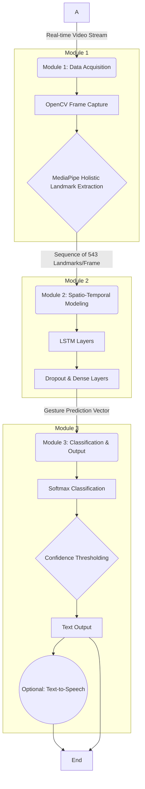

# Project Synopsis
## A Deep Learning Approach for Real-Time Indian Sign Language (ISL) Detection and Translation

**Submitted by:**  
> 1. Sabir Mallick  
> 12031522014  
> 2. Chandrajit Banerjee  
> 12031522060  
> 3. Aditi Biswas  
> 12031522049  

**Submitted to:**  
Prof. Prasenjit Maji  
Department of Computer Science and Design  
Dr. B.C. Roy Engineering College, Durgapur  

**Date:** September 1, 2025  

  
# A Real-time Vision-Based System for Indian Sign Language (ISL) Detection and Translation using Spatio-Temporal Deep Learning

## Abstract
Indian Sign Language (ISL) is the primary mode of communication for India's vast deaf and hard-of-hearing community, estimated to be over 18 million individuals. A significant communication barrier exists between ISL users and the non-signing population, exacerbated by a severe shortage of qualified human interpreters. This project synopsis proposes the design and development of a real-time, vision-based system to detect and translate dynamic ISL gestures into text, aiming to bridge this communication divide. The proposed system leverages a modular, deep learning architecture that is both computationally efficient and accessible, requiring only a standard webcam for input. The core of the system consists of three modules: (1) A data acquisition and feature extraction module using OpenCV and Google's MediaPipe Holistic framework to capture a comprehensive set of hand, face, and pose landmarks in real-time ; (2) A spatio-temporal modeling module employing a Long Short-Term Memory (LSTM) network to learn and classify the temporal sequences of dynamic gestures ; and (3) An output module that translates the recognized sign into English text and provides an optional speech synthesis. This approach addresses key challenges in the field, including the need to process dynamic gestures and incorporate non-manual features, which are often neglected but are grammatically crucial in ISL. The system will be trained and evaluated on a publicly available ISL dataset, using standard performance metrics such as accuracy, precision, recall, F1-score, and inference latency to ensure both correctness and real-time responsiveness. This project not only represents a significant technical undertaking in computer vision and deep learning but also holds profound potential for enhancing social inclusion and accessibility for the deaf community in India. 

## 1. Introduction

### 1.1 The Communication Divide and the Role of Indian Sign Language
Communication is a cornerstone of human interaction, education, and societal participation. For the millions of individuals in India who are deaf or hard of hearing, Indian Sign Language (ISL) serves as this fundamental medium of expression. However, a profound communication barrier persists between the deaf community and the general population, largely due to the limited number of individuals proficient in ISL. Estimates suggest that while India's deaf community numbers over 18 million, there are only approximately 300 certified ISL interpreters available. This staggering disparity creates significant challenges, leading to social isolation and limiting access to essential services such as education, healthcare, and gainful employment. The scarcity of human interpreters makes automated translation systems not merely a technological convenience but a critical necessity for fostering social inclusion and empowering the deaf community.

  
*Figure 1: Conceptual representation of technology bridging the communication gap.*

The significance of ISL is formally recognized within India's legal framework. The Rights of Persons with Disabilities (RPwD) Act of 2016 officially acknowledges sign language as a valid form of communication. Further institutional support is demonstrated by the establishment of the Indian Sign Language Research and Training Centre (ISLRTC), an organization dedicated to the research, development, and standardization of ISL. These developments are crucial in legitimizing ISL as a complete and natural language, dispelling historical misconceptions of it being a mere collection of symbolic gestures. This formal recognition underscores the urgent need for technological solutions that treat ISL with the same linguistic rigor as spoken languages, thereby facilitating seamless communication and integration.   

### 1.2 The Grammatical and Structural Nuances of ISL
Developing an effective automated translation system for ISL requires a deep understanding of its unique linguistic characteristics, which differ substantially from spoken languages and even from other prominent sign languages. ISL is a distinct visual-gestural language with its own complex grammar and syntax. A common pitfall in this domain is the erroneous assumption that models and datasets developed for American Sign Language (ASL) can be directly applied to ISL. While ASL is heavily influenced by French Sign Language and predominantly uses one-handed gestures for fingerspelling, ISL has roots in British Sign Language and frequently employs two-handed signs. This prevalence of two-handed gestures introduces significant technical challenges, most notably self-occlusion, where one hand partially or fully obscures the other from the camera's view, complicating the process of accurate feature extraction.   

  
*Figure 2: Comparison of a one-handed ASL gesture versus a two-handed ISL gesture.*

ISL signs are broadly categorized along two axes: static versus dynamic, and manual versus non-manual. Static signs involve a fixed handshape and position, while dynamic signs incorporate movement, which is essential to their meaning. Manual components refer to the gestures made by the hands and arms. Critically,    

**non-manual markers**—which include facial expressions, body posture, head movements, and eye gaze—are not merely supplementary emotional cues; they are integral grammatical components that can fundamentally alter the meaning of a sign or an entire sentence. For example, the sign for "HAPPY" is accompanied by a smiling face, while "SAD" is signed with a sad facial expression; similarly, questions are often indicated by specific eyebrow movements. This multi-channel nature of ISL communication highlights the inadequacy of systems that focus solely on hand shapes. A robust recognition system must be capable of processing the spatial configuration of the hands, their temporal evolution through movement, and the parallel stream of information conveyed by non-manual markers.   

Furthermore, the grammatical structure of ISL diverges significantly from that of English. ISL typically follows a Subject-Object-Verb (SOV) sentence structure, in contrast to the Subject-Verb-Object (SVO) order common in English. The language also omits articles (a, an, the), linking verbs (is, am, are), and gerunds, and places interrogative words (who, what, where) at the end of a sentence. This grammatical disparity implies that a simple, direct sign-to-word mapping will result in incoherent and grammatically incorrect output. A true translation system must therefore perform a subsequent step of grammatical transformation, reordering the recognized signs to construct a syntactically correct sentence in the target spoken language.   

A persistent challenge underpinning ISL research is the "Standardization Paradox." While formal bodies like the ISLRTC are working towards standardization, a universally adopted standard remains elusive, with significant regional and dialectal variations persisting across the country. This lack of a unified standard is a primary contributor to the scarcity of large-scale, reliable datasets. As a result, researchers are often compelled to create their own datasets, which are typically limited in vocabulary, environmental conditions, and signer diversity. This data scarcity creates a high risk of model overfitting, a phenomenon where a machine learning model performs exceptionally well on the specific data it was trained on but fails to generalize to new signers, signs, or environments. Consequently, this paradox is not merely a background detail but a fundamental project constraint that must be addressed through strategic methodological choices, such as robust data augmentation and transfer learning techniques.   

### 1.3 Problem Statement and Project Objectives
The significant communication gap faced by the Indian deaf community, compounded by the unique linguistic complexities of ISL—including its reliance on dynamic, two-handed, and non-manual gestures—and the persistent lack of large-scale, standardized datasets, poses a formidable challenge for the development of an effective, automated, real-time translation system. Existing systems often fall short by focusing on static signs, ignoring non-manual features, or requiring specialized hardware that limits their accessibility.  

The **primary objective** of this project is to design, develop, and evaluate a vision-based system that can accurately detect and translate a core vocabulary of dynamic Indian Sign Language gestures into text in real-time. A key constraint is the use of only a standard webcam for input, ensuring the final solution is maximally accessible, affordable, and practical for widespread use.

To achieve this primary goal, the following secondary objectives have been defined:

 - To conduct a comprehensive literature review of state-of-the-art deep learning models and architectures for sign language recognition, evaluating their strengths and weaknesses in the context of ISL.

 - To design and implement a robust data processing pipeline for real-time video capture and feature extraction, leveraging the MediaPipe framework to obtain comprehensive hand, face, and pose landmarks.   

 - To develop and train a spatio-temporal deep learning model, specifically a Long Short-Term Memory (LSTM) network, capable of accurately classifying sequences of gestures corresponding to dynamic ISL signs.   

 - To rigorously evaluate the system's performance based on key metrics, including classification accuracy, precision, recall, and real-time inference latency, to validate its effectiveness and practicality.   

## 2. Motivation and Conceptual Framework

### 2.1 A Review of Automated Sign Language Recognition
The field of automated Sign Language Recognition (SLR) has undergone a significant evolution, driven by advancements in computer vision and machine learning. This progression provides the foundational context for the proposed system's architecture.

Early approaches to SLR were predominantly **sensor-based**, relying on specialized hardware to capture gesture data. These systems utilized devices such as data gloves embedded with flex sensors or motion controllers like the Microsoft Kinect, which could provide precise 3D positional data of the hands and body. While capable of achieving high accuracy, these methods suffer from major practical limitations. They are often intrusive, expensive, and can encumber the signer, restricting the natural and fluid movements that are essential to expressive sign language communication. Consequently, the field has largely shifted towards a
**vision-based** approach. This paradigm is far more accessible and practical, as it is cost-effective, non-invasive, and requires only a standard webcam, which is ubiquitous in modern computing devices. The proposed project will exclusively adopt this vision-based methodology to ensure its potential for real-world applicability.   

Within vision-based SLR, the complexity of models has evolved in tandem with the tasks they address. The initial focus was on **static sign recognition**, which involves identifying isolated gestures that do not involve movement, such as the individual letters of the fingerspelling alphabet. For this task, Convolutional Neural Networks (CNNs) have proven to be highly effective due to their ability to learn hierarchical spatial features directly from images. More advanced object detection models, particularly the You Only Look Once (YOLO) family, have been adapted for this purpose, offering a compelling balance of speed and accuracy essential for real-time applications. Recent studies have shown that models like YOLOv10 can achieve outstanding performance, reaching up to 99% mean Average Precision (mAP) with significantly faster inference times compared to previous versions like YOLOv5 for static ISL word recognition.   

However, a significant portion of ISL consists of **dynamic signs**, where the trajectory of movement is as important as the handshape itself. Static models are inherently incapable of capturing this crucial temporal information. This limitation necessitated the adoption of sequence models. **Long Short-Term Memory (LSTM) networks**, a specialized type of Recurrent Neural Network (RNN), have emerged as the standard for this task. LSTMs are specifically designed to learn long-term dependencies in sequential data, making them ideal for modeling the temporal evolution of a sign gesture from a sequence of video frames. A powerful and widely adopted architecture is the    

**CNN-LSTM hybrid**. In this model, a CNN acts as a spatial feature extractor for each individual frame of a video, and the resulting sequence of feature vectors is then fed into an LSTM, which learns the temporal patterns to make a final classification.   

The current frontier of SLR research is moving towards **end-to-end translation** using **Transformer models**. Originally developed for natural language processing, Transformers excel at capturing long-range dependencies in sequences through their self-attention mechanism. In the context of SLR, they can be trained in an end-to-end fashion to jointly perform recognition (translating video frames to an intermediate sign "gloss" representation) and translation (translating the gloss sequence into a grammatically correct spoken language sentence) within a single, unified architecture. This approach has achieved state-of-the-art results on benchmark datasets, in some cases more than doubling the performance of previous methods. While the complexity and substantial data requirements of Transformers place them beyond the scope of this undergraduate project, they clearly indicate the future trajectory of the field.   

**Table 1: Performance Benchmarks of State-of-the-Art SLR Architectures**  

| Architecture | Target Task | Reported Accuracy/Metric | Key Strengths | Key Weaknesses |
|--------------|-------------|--------------------------|---------------|----------------|
| YOLOv10 | Static Word Recognition | 99% mAP@50:95 | Extremely fast, high accuracy for static objects | Cannot process temporal sequences |
| CNN | Static Sign/Alphabet Recognition | 95-99% Accuracy | Excellent spatial extraction | No temporal modeling |
| CNN-LSTM Hybrid | Dynamic Word Recognition | 88-94% Accuracy | Combines spatial & temporal features | Computationally intensive |
| Transformer | End-to-End Translation | >21 BLEU-4 Score | State-of-the-art performance, handles long dependencies | High data & compute requirements |

### 2.2 Foundational Technologies and Prevailing Challenges
A significant catalyst for recent progress in vision-based SLR has been the development of robust, pre-trained frameworks for human pose estimation. Google's MediaPipe stands out as a foundational technology in this space. It provides a suite of highly optimized models capable of performing real-time landmark extraction for hands (21 keypoints per hand), face (468 keypoints), and body pose from a standard video stream. This technology effectively serves as a feature extraction abstraction layer. Whereas earlier research dedicated significant effort to brittle and computationally expensive computer vision techniques like skin color segmentation, background subtraction, and contour detection , MediaPipe offers a reliable, off-the-shelf solution. This abstraction allows researchers and developers to bypass this now-solved sub-problem and concentrate their efforts on the more complex challenges of temporal modeling and linguistic translation—the core of the recognition task. The availability of MediaPipe makes the development of a sophisticated, real-time dynamic recognition system feasible within the constraints of a final year project.  

  
*Figure 3: Visualization of the 21 hand landmarks extracted by MediaPipe.*  

Despite this, challenges remain:  

- **Data Scarcity**: Few large-scale standardized ISL datasets exist.  
- **Gesture Complexity**: Frequent two-handed signs cause occlusion issues.  
- **Non-Manual Features**: Often ignored despite grammatical importance.  
- **Real-Time Constraints**: Need for low-latency without sacrificing accuracy.  

### 2.3 Proposed System Architecture

*Figure 4: Proposed System Architecture Flowchart.*

#### Module I: Data Acquisition and Landmark Extraction  
**Input:** The system captures a real-time video stream from a standard webcam using **OpenCV** in Python.  
**Feature Extraction:** Each frame is processed with the **MediaPipe Holistic model**, chosen over MediaPipe Hands since it provides **543 landmarks per frame** (hands, face mesh, body pose). This addresses the *Non-Manual Feature Gap* by including crucial facial and body cues.  
**Output:** A sequence of normalized **3D coordinate vectors** for each gesture, which becomes the input for the modeling stage.  

#### Module II: Spatio-Temporal Modeling for Dynamic Gestures  
**Input:** Landmark sequences from Module I (fixed length, e.g., **30 frames**).  
**Model:** An **LSTM network** implemented with TensorFlow/Keras.  
- Chosen for learning temporal patterns from sequential data.  
- Multiple stacked LSTM layers + **Dropout layers** to prevent overfitting.  
**Purpose:** Differentiate dynamic signs that may look similar in handshape but differ in movement.  

#### Module III: Classification and Translation Output  
**Classification:** Final hidden state of LSTM → **Dense layer with Softmax**, producing probability distribution over sign categories.  
**Output:**  
- Recognized sign = category with highest probability.  
- Mapped to corresponding **English text word**.  
- Optionally integrated with **Text-to-Speech (TTS)** (e.g., gTTS) to provide audio output, completing the translation loop.  

### 2.4 Implementation and Evaluation Strategy

**Dataset Selection and Preparation:**  
The selection of an appropriate dataset is one of the most critical decisions for this project, given the aforementioned challenges of data scarcity. The primary dataset for training and evaluation will be the **ISL-CSLTR (Indian Sign Language Dataset for Continuous Sign Language Translation and Recognition)**. This dataset is a strong candidate because it is one of the few publicly available ISL resources that contains sentence-level videos performed by multiple signers under varied conditions, which is essential for training a model on dynamic gestures. For the scope of this project, the sentence-level videos will be pre-processed and segmented to extract isolated word-level sequences.   

To address the limited size of available datasets and improve the model's ability to generalize, **data augmentation** techniques will be employed. These techniques artificially increase the size and variability of the training data. For sequential landmark data, this can include adding small amounts of random noise to the coordinate positions, slightly altering the playback speed of the sequence, and mirroring the gestures horizontally to simulate both left- and right-handed signers.   

**Table 2: Comparative Analysis of Publicly Available ISL Datasets**  

| Dataset | Vocabulary Size | # Signers | Data Type | Sign Type | Limitations |
|---------|-----------------|-----------|-----------|-----------|-------------|
| ISL-CSLTR | ~1036 words, 100 sentences | 7 | Videos | Dynamic | Limited vocabulary |
| INCLUDE | 263 words | N/A | Videos | Dynamic | Only 15 categories |
| CISLR | ~4700 words | N/A | Videos | Dynamic | Variability issues |
| Kaggle Alphanumeric | 35 | Multiple | Images | Static | Not suitable for dynamic training |
| Custom | <50 | 1-few | Images/Videos | Static/Dynamic | Limited diversity, non-standard |

#### Performance Metrics  

The trained model will be rigorously evaluated on a held-out test set to assess **accuracy** and **real-world viability**.  

**Classification Metrics:**  
- **Accuracy:** Percentage of correctly classified signs.  
- **Precision:** Correctly identified positives ÷ all predicted positives.  
- **Recall:** Correctly identified positives ÷ all actual positives.  
- **F1-Score:** Harmonic mean of Precision and Recall, balancing both.  

**Real-Time Performance:**  
- Since the system is designed for live interaction, **speed is as important as accuracy**.  
- Key metric: **Inference Latency** → time taken from frame capture to output generation.  
- Measured in **milliseconds (ms)** with the goal of achieving latency low enough to feel instantaneous, ensuring smooth and natural communication.   

## 3. Future Work and Conclusion
This synopsis has outlined a comprehensive plan for the development of a real-time Indian Sign Language detection and translation system. By leveraging the power of the MediaPipe framework for robust feature extraction and an LSTM network for spatio-temporal modeling, the proposed project is well-positioned to create an effective tool for recognizing dynamic ISL gestures. The system's vision-based approach ensures accessibility and practicality, addressing a critical societal need by helping to bridge the communication gap for the deaf and hard-of-hearing community in India.

The successful implementation of this system will serve as a strong foundation, but it is important to recognize its place within the broader trajectory of SLR research. The natural evolution of this work points toward several key areas for future enhancement. The current focus on isolated word recognition is a necessary and challenging first step. The next logical progression is to tackle continuous sign language recognition, where the system must not only recognize signs but also segment them from a continuous stream of gestures—a significantly more complex task.

Furthermore, true translation requires more than just recognition. As the accuracy of sign recognition models improves, the primary bottleneck shifts from pattern recognition to linguistics. A system that simply outputs a sequence of recognized words (e.g., "I", "HOME", "GO") will fail to produce a grammatically correct English sentence. Therefore, a crucial future enhancement would be the integration of a linguistic post-processing module. This module would apply grammatical rules to transform the recognized SOV sign sequence into a coherent SVO English sentence ("I go home").   

Ultimately, the field is moving towards end-to-end models like the Transformer architecture. Future work could explore migrating the system to a Transformer-based model, which could learn both the visual recognition and the grammatical transformation tasks jointly in a single, powerful network. This would represent a significant step towards a truly seamless and accurate sign language translation system.   

In conclusion, this project provides a well-defined and achievable plan for a final year undertaking, while also demonstrating a clear understanding of the long-term challenges and opportunities in the field. By focusing on a robust, accessible, and modern deep learning architecture, this work aims to make a meaningful contribution to the vital area of assistive technology for the deaf community.

## 5. References
- Athira, P. M., & Sreeja, M. (2020). *A review on Indian Sign Language recognition.* I-SMAC.  
- Google AI (2020). *MediaPipe: A Framework for Building Perception Pipelines.*  
- Kishore, P. V. V., & Kumar, D. A. (2020). *A review on gesture recognition using deep learning.* JKSUCIS.  
- Hochreiter, S., & Schmidhuber, J. (1997). *Long short-term memory.* Neural computation, 9(8), 1735-1780.  
- Ojha, A., Pandey, S., & Jain, A. (2021). *INCLUDE: A Large Scale Dataset for Indian Sign Language Recognition.* WACV.  