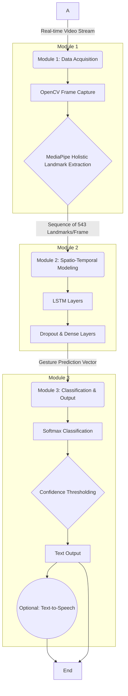

# Project Synopsis
## A Deep Learning Approach for Real-Time Indian Sign Language (ISL) Detection and Translation

**Submitted by:**  
> 1. Sabir Mallick  
> 12031522014  
> 2. Chandrajit Banerjee  
> 12031522060  
> 3. Aditi Biswas  
> 12031522049  

**Submitted to:**  
Prof. Prasenjit Maji  
Department of Computer Science and Design  
Dr. B.C. Roy Engineering College, Durgapur  

**Date:** September 1, 2025  

  
# A Real-time Vision-Based System for Indian Sign Language (ISL) Detection and Translation using Spatio-Temporal Deep Learning

## Abstract
Indian Sign Language (ISL) is the primary mode of communication for India's vast deaf and hard-of-hearing community, estimated to be over 18 million individuals. A significant communication barrier exists between ISL users and the non-signing population, exacerbated by a severe shortage of qualified human interpreters. This project synopsis proposes the design and development of a real-time, vision-based system to detect and translate dynamic ISL gestures into text, aiming to bridge this communication di...

## 1. Introduction

### 1.1 The Communication Divide and the Role of Indian Sign Language
Communication is a cornerstone of human interaction, education, and societal participation. For the millions of individuals in India who are deaf or hard of hearing, Indian Sign Language (ISL) serves as this fundamental medium of expression. However, a profound communication barrier persists between the deaf community and the general population, largely due to the limited number of individuals proficient in ISL. Estimates suggest that while India's deaf community numbers over 18 million, there are only ...

!(https://i.imgur.com/5gL1c8W.png)  
*Figure 1: Conceptual representation of technology bridging the communication gap.*

The significance of ISL is formally recognized within India's legal framework. The Rights of Persons with Disabilities (RPwD) Act of 2016 officially acknowledges sign language as a valid form of communication. Further institutional support is demonstrated by the establishment of the Indian Sign Language Research and Training Centre (ISLRTC), an organization dedicated to the research, development, and standardization of ISL. These developments are crucial in legitimizing ISL as a complete and natural lang...

### 1.2 The Grammatical and Structural Nuances of ISL
Developing an effective automated translation system for ISL requires a deep understanding of its unique linguistic characteristics, which differ substantially from spoken languages and even from other prominent sign languages. ISL is a distinct visual-gestural language with its own complex grammar and syntax. A common pitfall in this domain is the erroneous assumption that models and datasets developed for American Sign Language (ASL) can be directly applied to ISL. While ASL is heavily influenced by Fr...

!(https://i.imgur.com/aB3d4eF.png)  
*Figure 2: Comparison of a one-handed ASL gesture versus a two-handed ISL gesture.*

ISL signs are broadly categorized along two axes: static versus dynamic, and manual versus non-manual. Static signs involve a fixed handshape and position, while dynamic signs incorporate movement, which is essential to their meaning. Manual components refer to the gestures made by the hands and arms. Critically, non-manual markers—which include facial expressions, body posture, head movements, and eye gaze—are not merely supplementary emotional cues; they are integral grammatical components that can fun...

Furthermore, the grammatical structure of ISL diverges significantly from that of English. ISL typically follows a Subject-Object-Verb (SOV) sentence structure, in contrast to the Subject-Verb-Object (SVO) order common in English. The language also omits articles (a, an, the), linking verbs (is, am, are), and gerunds, and places interrogative words (who, what, where) at the end of a sentence. This grammatical disparity implies that a simple, direct sign-to-word mapping will result in incoherent and gramm...

A persistent challenge underpinning ISL research is the "Standardization Paradox." While formal bodies like the ISLRTC are working towards standardization, a universally adopted standard remains elusive, with significant regional and dialectal variations persisting across the country. This lack of a unified standard is a primary contributor to the scarcity of large-scale, reliable datasets. As a result, researchers are often compelled to create their own datasets, which are typically limited in vocabular...

### 1.3 Problem Statement and Project Objectives
The significant communication gap faced by the Indian deaf community, compounded by the unique linguistic complexities of ISL—including its reliance on dynamic, two-handed, and non-manual gestures—and the persistent lack of large-scale, standardized datasets, poses a formidable challenge for the development of an effective, automated, real-time translation system. Existing systems often fall short by focusing on static signs, ignoring non-manual features, or requiring specialized hardware that limits the...

**Primary Objective:**  
Design, develop, and evaluate a vision-based system that can accurately detect and translate a core vocabulary of dynamic Indian Sign Language gestures into text in real-time using only a standard webcam.

**Secondary Objectives:**  
- Conduct a comprehensive literature review of state-of-the-art deep learning models and architectures for sign language recognition.  
- Design and implement a robust data processing pipeline for real-time video capture and feature extraction using MediaPipe.  
- Develop and train a spatio-temporal deep learning model (LSTM).  
- Rigorously evaluate performance based on accuracy, precision, recall, and inference latency.  

## 2. Motivation and Conceptual Framework

### 2.1 A Review of Automated Sign Language Recognition
The field of automated Sign Language Recognition (SLR) has undergone a significant evolution, driven by advancements in computer vision and machine learning. Early approaches were sensor-based but were intrusive and expensive. The paradigm has shifted to vision-based methods, which are cost-effective, non-invasive, and accessible with standard webcams.

CNNs excel at static recognition, YOLO models (e.g., YOLOv10) achieve 99% mAP for static ISL words, but dynamic gestures require sequence modeling. LSTMs and CNN-LSTM hybrids have been adopted to handle temporal sequences effectively. Transformers are now pushing towards end-to-end recognition and translation, though their requirements exceed the scope of this project.

**Table 1: Performance Benchmarks of State-of-the-Art SLR Architectures**  

| Architecture | Target Task | Reported Accuracy/Metric | Key Strengths | Key Weaknesses |
|--------------|-------------|--------------------------|---------------|----------------|
| YOLOv10 | Static Word Recognition | 99% mAP@50:95 | Extremely fast, high accuracy for static objects | Cannot process temporal sequences |
| CNN | Static Sign/Alphabet Recognition | 95-99% Accuracy | Excellent spatial extraction | No temporal modeling |
| CNN-LSTM Hybrid | Dynamic Word Recognition | 88-94% Accuracy | Combines spatial & temporal features | Computationally intensive |
| Transformer | End-to-End Translation | >21 BLEU-4 Score | State-of-the-art performance, handles long dependencies | High data & compute requirements |

### 2.2 Foundational Technologies and Prevailing Challenges
MediaPipe Holistic provides 543 landmarks (hands, face, pose) per frame, enabling robust feature extraction. Despite this, challenges remain:  

- **Data Scarcity**: Few large-scale standardized ISL datasets exist.  
- **Gesture Complexity**: Frequent two-handed signs cause occlusion issues.  
- **Non-Manual Features**: Often ignored despite grammatical importance.  
- **Real-Time Constraints**: Need for low-latency without sacrificing accuracy.  

### 2.3 Proposed System Architecture

*Figure 4: Proposed System Architecture Flowchart.*

### 2.4 Implementation and Evaluation Strategy

**Datasets:**  
Primary: ISL-CSLTR (sentence-level dataset, segmented to word-level).  
Secondary: INCLUDE, CISLR, Kaggle Alphanumeric, custom datasets with augmentation.

**Table 2: Comparative Analysis of Publicly Available ISL Datasets**  

| Dataset | Vocabulary Size | # Signers | Data Type | Sign Type | Limitations |
|---------|-----------------|-----------|-----------|-----------|-------------|
| ISL-CSLTR | ~1036 words, 100 sentences | 7 | Videos | Dynamic | Limited vocabulary |
| INCLUDE | 263 words | N/A | Videos | Dynamic | Only 15 categories |
| CISLR | ~4700 words | N/A | Videos | Dynamic | Variability issues |
| Kaggle Alphanumeric | 35 | Multiple | Images | Static | Not suitable for dynamic training |
| Custom | <50 | 1-few | Images/Videos | Static/Dynamic | Limited diversity, non-standard |

**Evaluation Metrics:**  
- Accuracy, Precision, Recall, F1-Score  
- Inference Latency (ms)  

## 3. Future Work and Conclusion
This project will deliver a webcam-based ISL recognition and translation system, demonstrating the feasibility of vision-based SLR. Future work includes:  

- Transitioning from isolated words to continuous sign recognition.  
- Adding grammatical transformation modules (SOV → SVO).  
- Exploring Transformer-based end-to-end translation systems.  

The project thus bridges a critical communication divide and lays the groundwork for more advanced, inclusive sign language technologies.